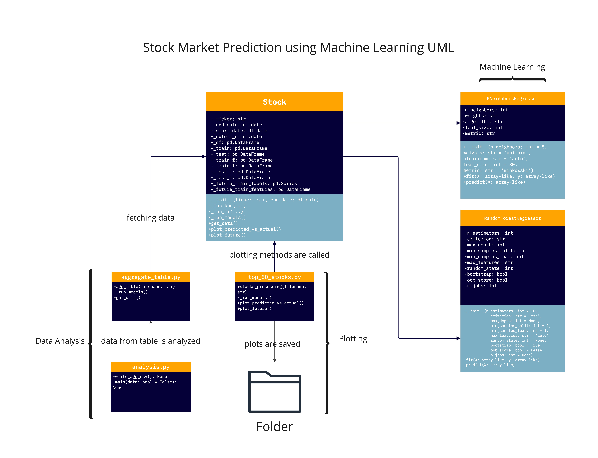
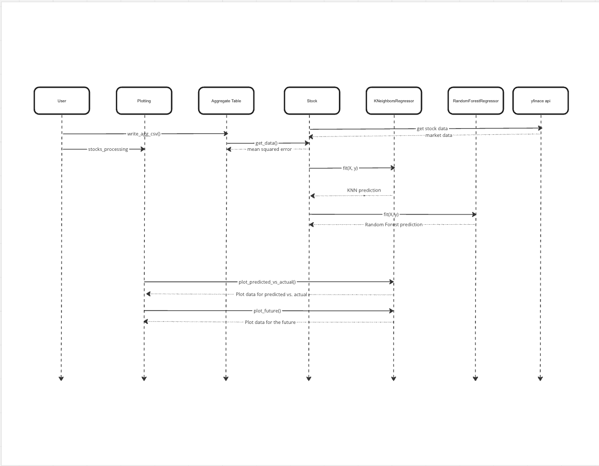

# ml-stock

## About

All-in-one stock price prediction models using scikit-learn.

Downloads data from Yahoo Finance, trains machine learning models using past data, outputs one month of predictions.

Built-in visualization methods using Plotly.

*CSE 163 Final Project (Winter 2023)*

## Setup

1. Install Dependences

```{python}
python3 -m pip install pandas numpy plotly yfinance scikit-learn
```

2. Run test script to check

```{python}
python3 test_stock.py
```

If the test script produces no output, then your environment is successfully configured!

## Usage

The Stock class located within `stock.py` contains all logic for downloading, running models and plotting results.

Example:

```{python}
from stock import Stock

aapl = Stock('AAPL')
aapl.run_models()  # Run ML Models
aapl.get_data()  # Return error rates
aapl.plot_predicted_vs_actual()  # Saves visualizations to 'plots' folder 
aapl.predict_future()  # Saves visualizations to 'plots' folder 
```

## Recreating Report Results

The file `stocks.txt` defines which stocks are included in the analysis.  Currently, they are the top 50 performing stocks.

To recreate the analysis used in our final report:
- Run `top50plots.py` to generate the visualizations for each stock.
- Run `analysis.py` to calculate which models were the most and least accurate.
    - Change the main function's parameter to `True` to recompute the results.csv file.  By default, the program uses the included file (the specific one we used in our analysis).

(The visualizations used in the report are predictions of AAPL price -- the example code in the usage section will generate them)

## INFO 443 Checkpoint 2

Here are the UML and Data Flow diagrams for checkpoint 2.




## Acknowledgements

- Prof. Schaefer for `cse163_utils.py` and the assert_equals function, used for testing.
- [yfinance](https://pypi.org/project/yfinance/), used to download price data from Yahoo finance
- Other packages used: [NumPy](https://numpy.org/), [Pandas](https://pandas.pydata.org/), [Scikit-learn](https://scikit-learn.org/stable/), [Plotly Python Library](https://plotly.com/python/)