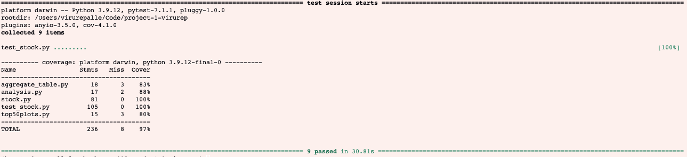

# Stock Market Prediction Using Machine Learning

## About

All-in-one stock price prediction models using scikit-learn.

Downloads data from Yahoo Finance, trains machine learning models using past data, outputs one month of predictions.

Built-in visualization methods using Plotly.

*CSE 163 Final Project (Winter 2023)*

## Setup

 Installing Dependencies

```{python}
python3 -m pip install pandas numpy plotly yfinance scikit-learn pytest
```

## Usage

The Stock class located within `stock.py` contains all logic for downloading, running models and plotting results.

Example:

```{python}
from stock import Stock

aapl = Stock('AAPL')
aapl.run_models()  # Run ML Models
aapl.get_data()  # Return error rates
aapl.plot_predicted_vs_actual()  # Saves visualizations to 'plots' folder 
aapl.predict_future()  # Saves visualizations to 'plots' folder 
```

# INFO 443 PROJECT 1 REPORT

###  Viru Repalle and Jessica Mendoza | November 1st, 2023


## Code Structure Analysis

### Project Summary

This project has three main areas where it aims to accurately train and predict stock market data. They are listed below.

Data Processing: Our preprocessing code will compile data based on the specified stock ticker. The module will parse the stock data from yfinance and process dates for each stock, meaning that our model will be run on a set of 365 days' worth of data. Running the models only on the most recent year is vital for relevance reasons. In terms of predicting the performance of a stock, which is one of our research questions, utilizing data for the stock back when it was worth less than a dollar when it could potentially be worth hundreds today wouldn’t be a great indicator of how it will perform in the future, so it is excluded. In order to compute the dates within Python efficiently, we utilized the library datetime. 

Machine Learning: This project primarily uses machine learning to predict stock market trends. Therefore, our selected model must meet the following requirements: understand the concept of Time, take in multiple days' worth of data, and output 30-60 data points representing future data. Our model's features will be the opening price, the high/low, and the volume. However, the volume will be one of our independent variables. We compared the inclusion of the volume in each model and how it affected accuracy. Our labels will be the adjusted closing prices. We will split our data to include 60 days' worth of data testing data, and the remaining 191 days will be the training data. This split will not be random because we are using a time-oriented dataset. Then the data will be separated into data with volume and without volume.

We will implement and compare two different machine learning models to see which model can more accurately predict stock market data. We chose our models after reviewing similar projects and landed on K-Nearest Neighbor Regression(KNN) and Random Forest Regression. The KNN works by finding the closest-looking data point to an input point and mapping them together. Meanwhile, the Random Forest Regressor works by aggregating all of the outputs of multiple decision trees and finding the average of the most optimal values. The models can then be run on our test data to see their accuracy. We will use mean squared error to test the accuracy. The most accurate model will then be used to predict future data. 

Visualization: To add a visual aid to our model, we will use the Plotly library to graph the predicted stock data versus the actual stock data. By plotting them on the same axis we are able to visualize the accuracy of our machine learning model. Then we will use the Plotly library to predict future data for 2 months in advance. We determined the Plotly library to be the best because it can plot data according to time in a much more aesthetic format that allows us to accurately see the date.


### Architectural Elements

The primary logic of the project lies within the `Stock` class. This class contains seven methods that are called on by other files within the project. The methods alongside their functionality is as follows:

**`__init__`**
* Initializes a Stock object by downloading 1 year of stock data for a given ticker symbol. It splits the data into training and test datasets, with the test data representing the last 2 months of the data.

**`_run_knn`**
* Fits a K-Nearest Neighbors (KNN) model given training and testing data pre-split. Returns a tuple containing the KNN model, the predicted data, and the Mean Squared Error (MSE).

**`_run_fr`**
* Fits a Random Forest (RF) model given training and testing data pre-split. Returns a tuple containing the Random Forest model, the predicted data, and the Mean Squared Error (MSE).

**`run_models`**
* Runs both KNN and Random Forest models using the training and test data and stores the results as private fields for later use with helper methods. It does this for both datasets with and without volume information.

**`get_data`**
* Returns a dictionary containing the Mean Squared Error (MSE) values of the four tested models, including KNN and Random Forest models with and without volume information.

**`plot_predicted_vs_actual`**
* Plots the predicted stock prices versus the actual stock prices for both KNN and Random Forest models, with and without volume information. It saves the plots as image files.

**`plot_future`**
* Plots the future predicted stock prices for a month in advance using the Random Forest Regressor, which is assumed to have the least amount of error. It saves the plot as an image file.

These functions have the capbility to clean up the data, run the machine learning models, and plot the data. They are then called by the aggregate_table process and the top_fifty_plots method. 

The aggregate table is a csv table created to look at the mean-squared error(mse) of each of the machine learning models. The mse is used to calculate the accuracy of the model. It is important to find the most accurate model so that we are able to accurately predict future data. This file primarily calls the `run_models` method from the stock class.

Meanwhile the top 50 plots file uses a list of the top 50 traded stocks on the United States Stock Market and plots five graphs for each stock. Four of these plots are the comparisions of the machine learning predicted data. These plots are useful for providing a comparision for the machine learning model versus what actually happened in the markets. The final plot is future prediction that is used by our calculated most accurate model. This plot helps to see what the plot is going to look like 60 days in the future. This module uses the `run_models` and ` plot_future` methods to visualize the machine learning calculated data.

In addition, to the logic created by my team, our modules use two machine learning regressors provided by sci-kit learn to run the training and prediction of the data. 

* K-NN Regressor relies on the similarity between data points. To make a prediction, it finds the K-nearest neighbors to a new data point based on a distance metric and averages their target values to produce the final prediction.

* Random Forest Regressor, on the other hand, builds an ensemble of decision trees. Each tree is trained on a different subset of the data and features. When making a prediction, it aggregates the predictions from all trees to obtain the final result. This ensemble approach helps reduce overfitting and improves the model's accuracy.

These models are utilized by the `Stock` class and the values that they return are used across the various methods in the class.

The last file that this project utilizes is the analysis file. This file uses the aggregate table that was created earlier and looks at the calcualted mse values to determine which model has the most accurate prediction. 

**To visually understand how these files are connected refer to the UML diagram below:**


### Information Process Flows


## Architecure Analysis

To meet the size requirements for the architecural analysis I am using the entire module. This includes the files `Stock.py, top_50_stocks.py, aggregate_table.py, and analysis.py`. Please note that it doesn't use the machine learning models or the yfinace API since our project did not contribute to those platforms.

### Problems:

**Long Method**: The `plot_predicted_vs_actual` method  is quite long and contains repetitive code for plotting different models. 

**Hardcoded Values** : There are some hardcoded values, such as 60 in `fig_future.add_trace`, which could be replaced with named constants for better readability and maintainability.

**No Error Handling in Plotting**: The code for plotting (`plot_predicted_vs_actual`,`plot_future`) doesn't handle potential errors when saving plot images. It's important to handle exceptions that might occur during file operations.

**Unecessary Use of Global Main Function**: In the `analysis.py` file the analysis is done within the main function, this code can be rewritten as it's own function to be called in main. This makes the code more readable and easier to test. This was an architectural defienciency because it made it very difficult to test.

**Lack of Comments/Documentation**: While there are some docstrings present, there are still some parts of the code that could benefit from more comments or explanations. For instance, the purpose of the private fields and their naming conventions could be clarified.

**Inconsistent Naming**: In the Stock class some variables are named differently from similar couterparts which may cause confusion. For example, `cutoff_d `is used while variables such as `start_date` and `end_date` have the word date in their names.

## Automated Tests

To by able to run the tests you must have pytest installed. You can do this like so.

```{python}
python3 -m pip install pytest
```

The testing file is labeled as `test_stock.py`. To run the tests first navigate to the directory within the terminal, then you can simply type `pytest`. To see the coverage information you can use `pytest --cov`.

```{python}
directory/project-1-virurep pytest
directory/project-1-virurep pytest --cov
```

We have written the following tests to evaluate the code:

1. **test_initializer():**
   - **Inputs tested:** The initialization of the `Stock` class with a specific ticker and end date.
   - **Justification:** This test ensures that the `Stock` class initializes with the correct attributes, including the ticker, start date, end date, cutoff date, and data frame. It also verifies that the data is split correctly.

2. **test_knn():**
   - **Inputs tested:** The `_run_KNN` method of the `Stock` class.
   - **Justification:** This test checks if the K-Nearest Neighbors (KNN) model runs without errors and returns the expected output, which includes a KNeighborsRegressor instance, a specific number of predictions, and the correct data type for the error metric.

3. **test_fr():**
   - **Inputs tested:** The `_run_fr` method of the `Stock` class, which implements the Random Forest Regressor model.
   - **Justification:** This test verifies that the Random Forest Regressor model runs without errors and returns the expected output, including a RandomForestRegressor instance, a specific number of predictions, and the correct data type for the error metric.

4. **test_output_data():**
   - **Inputs tested:** The `run_models` and `get_data` methods of the `Stock` class.
   - **Justification:** This test checks if the models run successfully and if the data returned by the `get_data` method is as expected in terms of keys, lengths, and data types.

5. **test_plot_predicted_vs_actual():**
   - **Inputs tested:** The `plot_predicted_vs_actual` method of the `Stock` class.
   - **Justification:** This test ensures that the method generates plot files for predicted vs. actual values and checks if these files exist in the "plots" folder.

6. **test_plot_future():**
   - **Inputs tested:** The `plot_future` method of the `Stock` class.
   - **Justification:** This test verifies that the method generates plot files for future values and checks if these files exist in the "plots" folder.

7. **test_agg_table_generation():**
   - **Inputs tested:** The `agg_table` function.
   - **Justification:** This test checks if the function generates an aggregate table correctly by providing a sample file and verifying the resulting DataFrame's structure.

8. **test_write_agg_csv():**
   - **Inputs tested:** The `write_agg_csv` function.
   - **Justification:** This test verifies that the function correctly generates an output CSV file, checks the data type of the returned DataFrame, captures the printed output, and checks for the presence of expected output messages and DataFrame columns.

9. **test_stocks_processing():**
   - **Inputs tested:** The `stocks_processing` function.
   - **Justification:** This test ensures that the function processes a sample stocks file correctly, creates output files in the "plots" folder, and checks if the expected files are present in the "plots" folder.

Overall these tests cover the majority of the code as evaluated by `pytest --cov`. It is important to note that the missed areas of the tests refer to the main function within the files. This does not need to be tested because the main function just runs the other functions; it does not contain logic of its own.



## Refactoring Code


## Acknowledgements

- [yfinance](https://pypi.org/project/yfinance/), used to download price data from Yahoo finance
- Other packages used: [NumPy](https://numpy.org/), [Pandas](https://pandas.pydata.org/), [Scikit-learn](https://scikit-learn.org/stable/), [Plotly Python Library](https://plotly.com/python/)